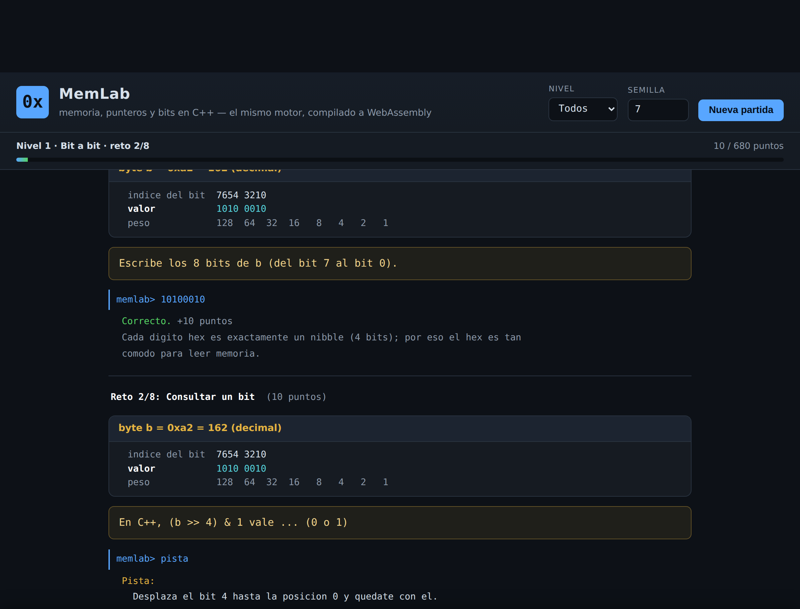
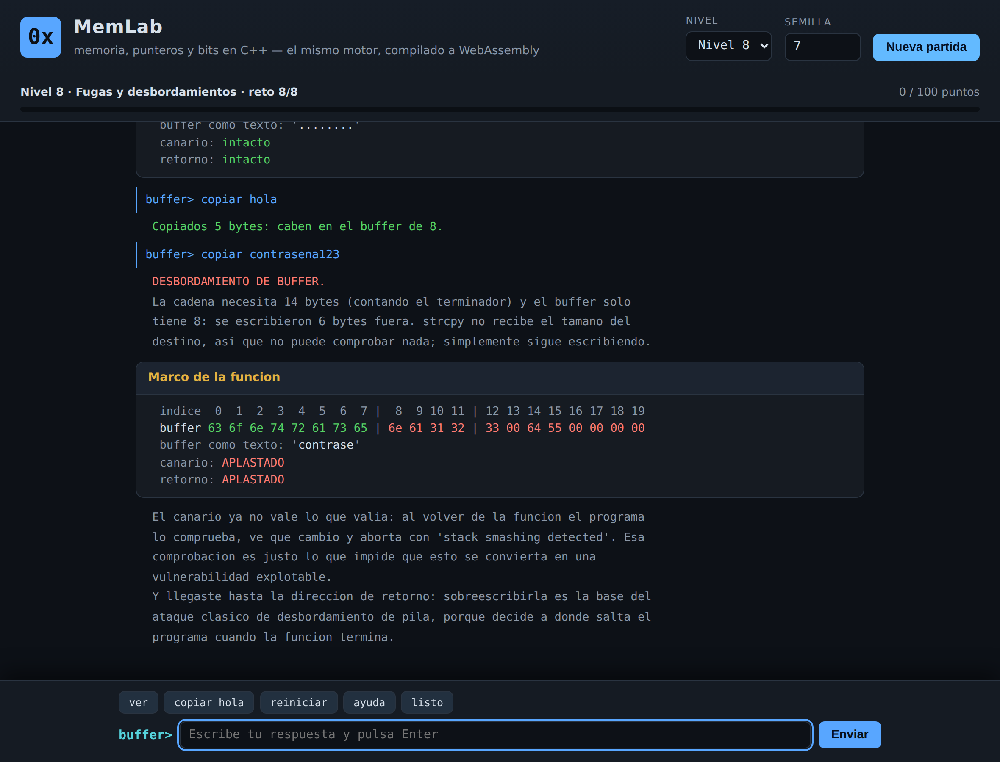
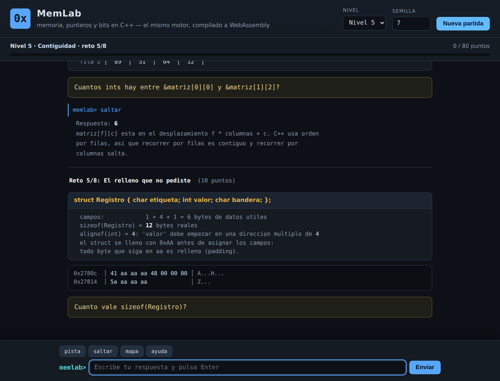
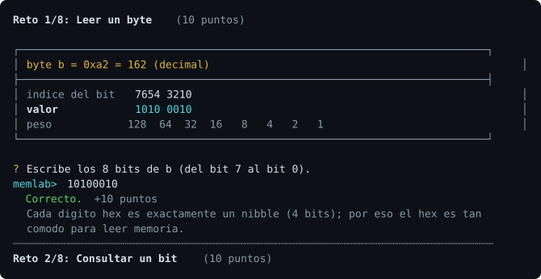
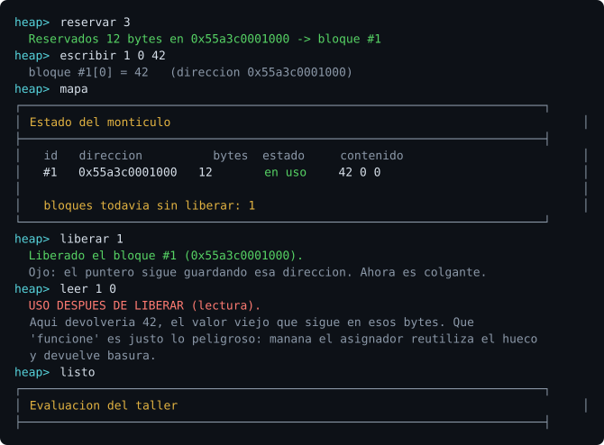
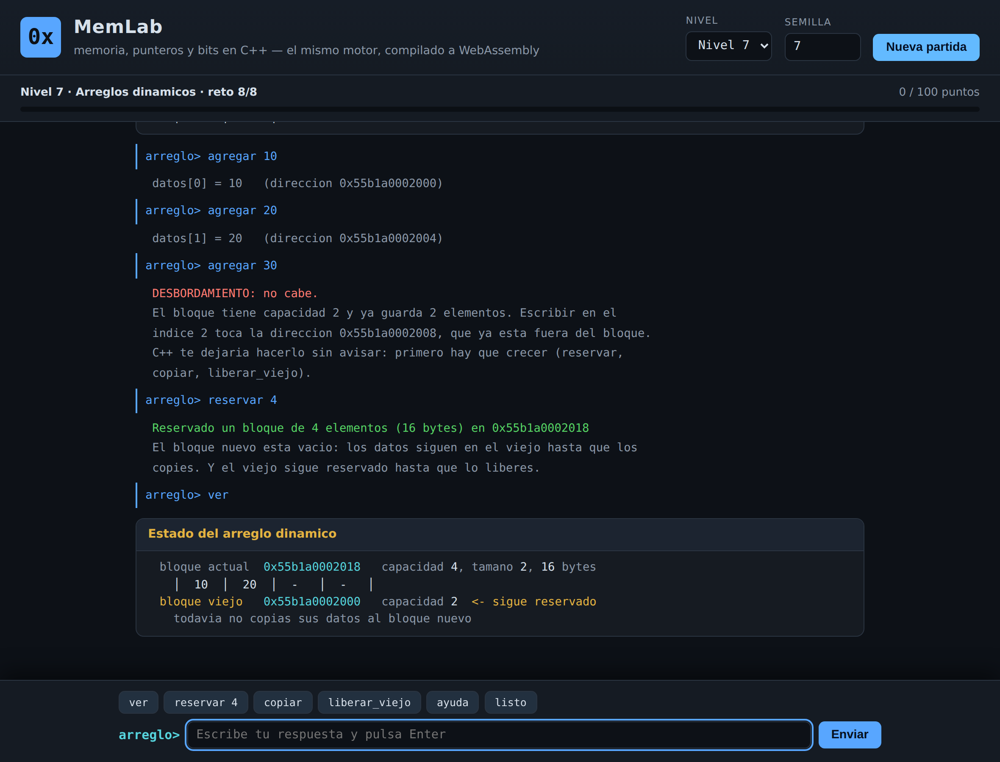

# MemLab — práctica de manejo de memoria en C++

Juego para entender cómo funciona la memoria en C++: bits y bytes, representación
de valores, punteros, contigüidad, el montículo, arreglos dinámicos, fugas de
memoria y desbordamientos de búfer.

Se puede jugar de dos maneras, **con el mismo motor de C++**:

| | |
| --- | --- |
| **En la terminal** | `make jugar` — sin dependencias, solo un compilador de C++17 |
| **En el navegador** | el mismo código compilado a WebAssembly, con interfaz gráfica |

Lo que distingue a MemLab de un cuestionario: **todo lo que muestra es memoria
real del proceso que lo ejecuta**. Las direcciones, los volcados hexadecimales,
los tamaños y los desplazamientos se calculan en tiempo de ejecución con
`sizeof`, `alignof`, `offsetof` y aritmética de punteros sobre variables vivas.
Nada está escrito a mano en el enunciado.

---

## La versión web



El taller del nivel 8 deja aplastar un marco de pila y ver, byte a byte, qué se
corrompió:



Y el volcado del nivel 5 muestra el relleno que el compilador inserta dentro de
un `struct` (los bytes `aa` son relleno de verdad, no un dibujo):



### Cómo jugarla

El módulo ya compilado está en el repositorio, así que basta con servir la
carpeta `web/`:

```bash
python3 -m http.server -d web 8000      # y abre http://localhost:8000
```

Hace falta servirlo por HTTP: abrir `index.html` como archivo local no permite
cargar el módulo WebAssembly.

### Cómo se recompila

Solo si cambias el C++. Necesitas el SDK de Emscripten:

```bash
git clone https://github.com/emscripten-core/emsdk.git
cd emsdk && ./emsdk install latest && ./emsdk activate latest && source ./emsdk_env.sh
cd -

./web/construir.sh                      # regenera web/wasm/memlab.js y .wasm
```

### Cómo está hecha

No hay lógica de juego duplicada en JavaScript. El motor de C++ es el mismo y la
página solo lo viste:

- **Salida.** El motor no sabe nada de HTML: escribe líneas de texto con marcas
  de control (`include/ui.hpp`), y `web/app.js` las convierte en nodos del DOM.
  El texto se inserta con `textContent`, nunca como HTML, así que no hay forma de
  inyectar marcado.
- **Entrada.** El juego se lee del jugador con `ui::leer_linea`. En la terminal
  eso es `std::getline`; en el navegador es una función asíncrona que espera a
  que escribas, gracias a Asyncify (`-sASYNCIFY`), sin bloquear la página.
- **Estado.** El motor emite el nivel, el reto y los puntos en una línea marcada,
  y la página dibuja con eso la barra de progreso.

Las direcciones que verás en la web son las reales del módulo WebAssembly (más
bajas y ordenadas que las de Linux, porque la memoria lineal del wasm empieza en
cero); las de la versión nativa son las que reparte tu sistema operativo.

---

## La versión de terminal



```bash
make            # compila el juego -> ./memlab
make jugar      # compila y arranca una partida
make pruebas    # compila y ejecuta las pruebas automáticas
make demo       # recorre todos los retos mostrando las respuestas
```

O con CMake:

```bash
cmake -B build && cmake --build build && ./build/memlab
```

| Opción | Para qué sirve |
| --- | --- |
| `--nivel N` | juega solo el nivel N (1 a 8) |
| `--semilla N` | fija la semilla: la misma partida, los mismos números |
| `--demo` | recorre todos los retos mostrando y verificando las respuestas |
| `--lista` | muestra los niveles disponibles |
| `--sin-color` | desactiva los colores ANSI |
| `--sin-guardado` | no escribe el archivo `.memlab_progreso` |

Durante la partida puedes escribir `pista` (cuesta la mitad de los puntos),
`saltar`, `mapa` para redibujar la escena, `ayuda` o `salir`. Las respuestas
numéricas se aceptan en decimal (`42`), hexadecimal (`0x2a`) o binario
(`0b101010`); cuando el reto pide un patrón de bits basta con escribirlo tal cual
(`0010 1010`).

La misma semilla da exactamente la misma partida en la terminal y en el
navegador: el sorteo usa una distribución propia (`util::entero_en_rango`),
porque `std::uniform_int_distribution` no está especificada y reparte distinto en
cada biblioteca estándar.

---

## Los ocho niveles

1. **Bit a bit** — leer un byte, consultar, encender y apagar bits con máscaras,
   desplazamientos, XOR y conteo de unos.
2. **Bytes en fila** — `sizeof`, volcado hexadecimal, *endianness* detectado en
   tiempo de ejecución, reconstruir un valor desde sus bytes, mirar la memoria
   con un `unsigned char*`.
3. **El significado de los bits** — aritmética modular sin signo, complemento a
   dos, el mismo patrón leído como `int8_t` y como `unsigned char`, y el desglose
   de un `float` en signo, exponente y mantisa (IEEE-754).
4. **Punteros** — `&` y `*`, tamaño de un puntero, escritura a través de un
   puntero, punteros dobles, aritmética de punteros con direcciones reales, resta
   de punteros y por qué un `char*` avanza distinto que un `int*`.
5. **Contigüidad** — el arreglo como bloque continuo, cálculo de direcciones,
   `datos[i]` como `*(datos + i)`, matrices en orden por filas, alineación y
   relleno de `struct` (con el relleno visible en el volcado), y por qué la caché
   premia recorrer memoria contigua.
6. **El montículo** — pila contra montículo comparando direcciones reales,
   `new[]`/`delete[]`, fugas, punteros colgantes, RAII, y un **taller
   interactivo**: un asignador simulado donde reservas, escribes y liberas
   bloques mientras el juego detecta fugas, usos después de liberar, dobles
   liberaciones y accesos fuera de rango.
7. **Arreglos dinámicos** — por qué `sizeof` no sirve para medir un `new int[n]`,
   dónde guarda `delete[]` el número de elementos, el costo de crecer copiando,
   matrices dinámicas (arreglo de punteros contra un único bloque contiguo) y la
   capacidad real de `std::vector` medida en ejecución. Su **taller** te pone a
   hacer de `std::vector`: reservar, copiar, liberar el bloque viejo y volver a
   crecer.
8. **Fugas y desbordamientos** — contar los bytes que se fugan en un fragmento,
   distinguir qué es fuga y qué no, el error de uno (*off-by-one*), `strcpy` sobre
   un búfer pequeño, qué hay justo detrás de un arreglo local, el desbordamiento
   de entero que acaba en desbordamiento de memoria, y las herramientas que los
   detectan. Su **taller** simula un marco de pila con canario y dirección de
   retorno.

Los talleres detectan de verdad lo que haces mal:



Y el del nivel 7 te obliga a hacer los tres pasos del crecimiento a mano —
reservar, copiar y liberar el bloque viejo — contando cada byte que se fuga:



---

## Ejemplos para experimentar con sanitizadores

En `ejemplos/` hay seis programas cortos que provocan (o evitan) errores de
memoria de verdad. Se compilan con AddressSanitizer y UndefinedBehaviorSanitizer:

```bash
make ejemplos
./build/ejemplos/01_fuga              # AddressSanitizer: 12000 bytes leaked
./build/ejemplos/02_colgante          # uso después de liberar
./build/ejemplos/03_desbordamiento    # escribir fuera de un arreglo
./build/ejemplos/04_representacion    # observar bytes, padding y IEEE-754
./build/ejemplos/05_raii              # la versión correcta, sin new ni delete
./build/ejemplos/06_arreglo_dinamico  # un vector casero que crece copiando
```

Vale la pena ejecutar el 02 y el 03 **también sin sanitizador** para ver lo
importante: sin herramientas, un error de memoria a menudo no se nota. El 03
además muestra un caso que ni AddressSanitizer detecta, porque el desbordamiento
aterriza justo dentro del bloque vecino.

---

## Estructura

```
include/            juego.hpp (retos y verificadores), ui.hpp, util.hpp, niveles.hpp
src/
  main.cpp          version de terminal: opciones de línea de comandos
  web.cpp           version web: puente entre el motor y el navegador
  juego.cpp         motor: puntuación, comandos, bucle de retos
  ui.cpp            dibujo: cajas y colores en terminal, marcas en web
  util.cpp          parseo de números, normalización de texto, sorteo portable
  niveles/          un archivo por nivel
web/
  index.html        la página
  estilo.css        tema oscuro, tarjetas, tipografía monoespaciada
  app.js            traduce la salida del motor a nodos del DOM
  construir.sh      compila el motor a WebAssembly con Emscripten
ejemplos/           programas para practicar con sanitizadores
docs/
  ansi_a_svg.py     convierte la salida de la terminal en las capturas del README
  capturas/         las imágenes de este README
tests/pruebas.cpp   pruebas automáticas sin dependencias
```

Cada reto declara su respuesta canónica junto a su verificador, y las pruebas
comprueban —con varias semillas— que la respuesta que el juego revela es aceptada
por su propio verificador. Así, si un nivel calcula mal un valor, las pruebas
fallan en vez de enseñarle algo incorrecto a quien juega.

```bash
make pruebas
# Pruebas de MemLab
# TODO BIEN: 3423/3423 comprobaciones correctas
```
